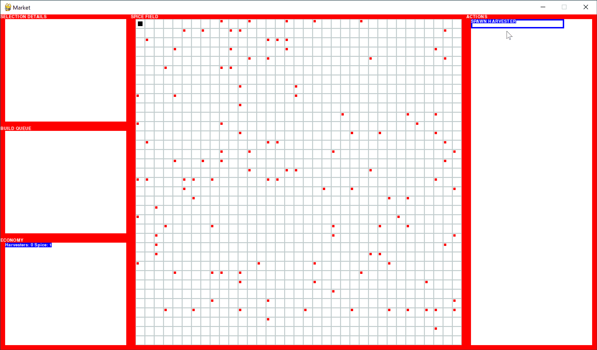

## Market: a simulation game of unknown scope.

#### Idea

The spice must flow.

#### Gameplay

#### Pointers

* [main.py](main.py): game entry point
* [test.py](test.py): test entry point
* [lib/entity.py](lib/entity.py): entity class which creates the scene graph
* [lib/entity_test.py](lib/entity_test.py): entity class tests
* [TODO.txt](TODO.txt): do, doing, done and dumped
