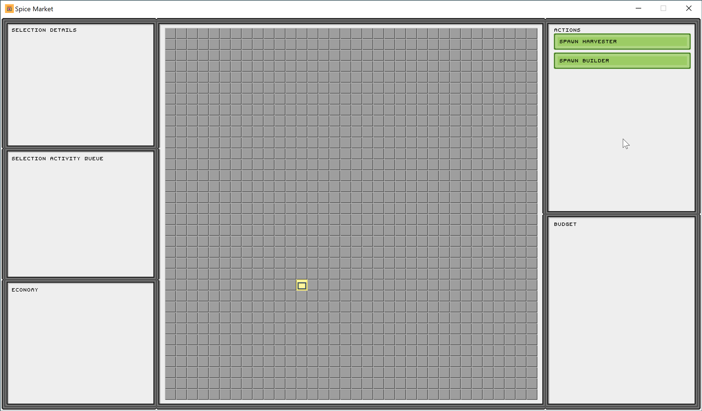

## Market: a simulation game of unknown scope.

#### Current Gameplay

Previously
* [Gameplay as of October 29, 2023](doc/screenshots/2023_10_29-progress.gif)
* [Gameplay as of October 21, 2023](doc/screenshots/2023_10_21-progress.gif)
* [Gameplay as of October 14, 2023](doc/screenshots/2023_10_14-progress.gif)

#### Theme

The spice must flow.

#### Winning

* Meet the demand of the spice market before going bankrupt.

#### Ideas

* With the context something has, it almost always makes the right decisions
* Constraints create interesting problems
* Harvest, transport, and protect enough spice to the market to meet demand
* Construction cost (time and spice)
* Construction cost can be wasted (partial builds, time and spice lost)
* Upkeep cost (spice)
* Starving upkeep kills (destroy units by underfunding upkeep)
* Simple automatons (ex: harvester, builder, courier, etc.)
* Theoretically infinite spice field

#### Constraints

* One unit per tile (under all conditions, ex: moving **and** spawning)
* One building per tile
* One resource per tile

#### Units

* **Builder**: wander away from its spawn base, build a new base, and self-destruct
* **Harvester**: wander around, gather spice, deposit spice at spawn base

#### Pointers

* [main.py](main.py): game entry point
* [lib/core/automaton.py](lib/core/automaton.py): finite state machine class
  * [lib/builder.py](lib/builder.py): Builder unit
  * [lib/harvester.py](lib/harvester.py): Harvester unit
* [lib/core/entity.py](lib/core/entity.py): entity class, basis of the scene graph
* [lib/core/sprite.py](lib/core/sprite.py): sprite class
* [TODO.md](TODO.md): do, doing, done and dumped
